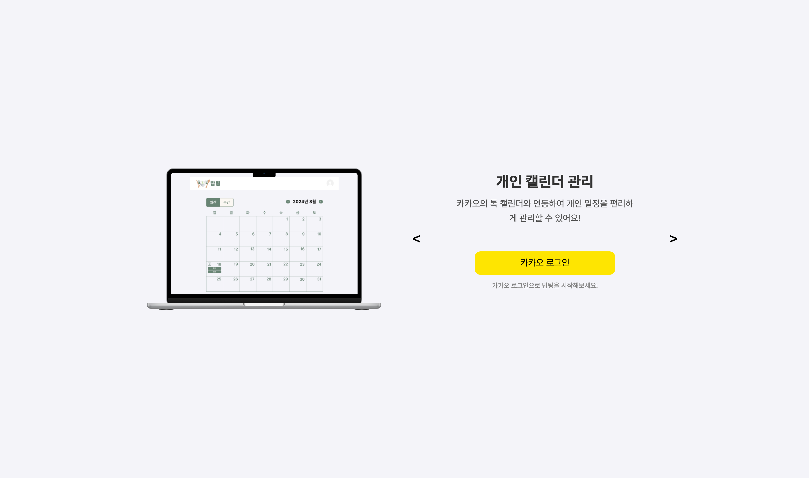
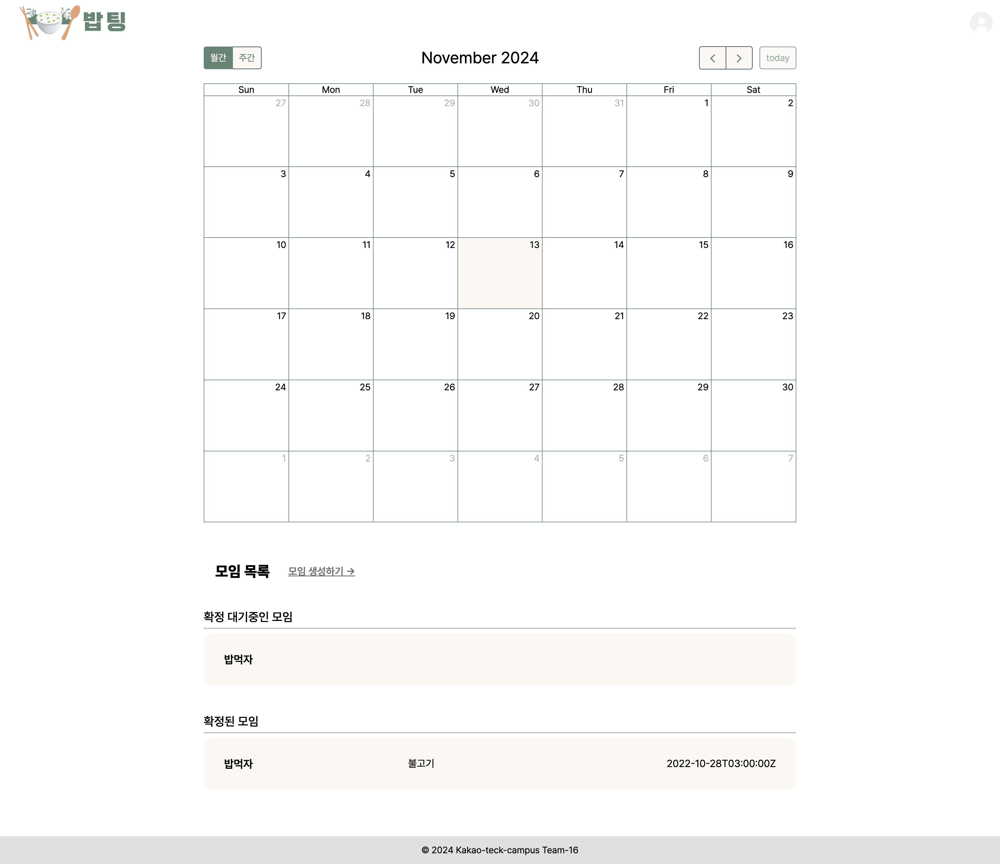
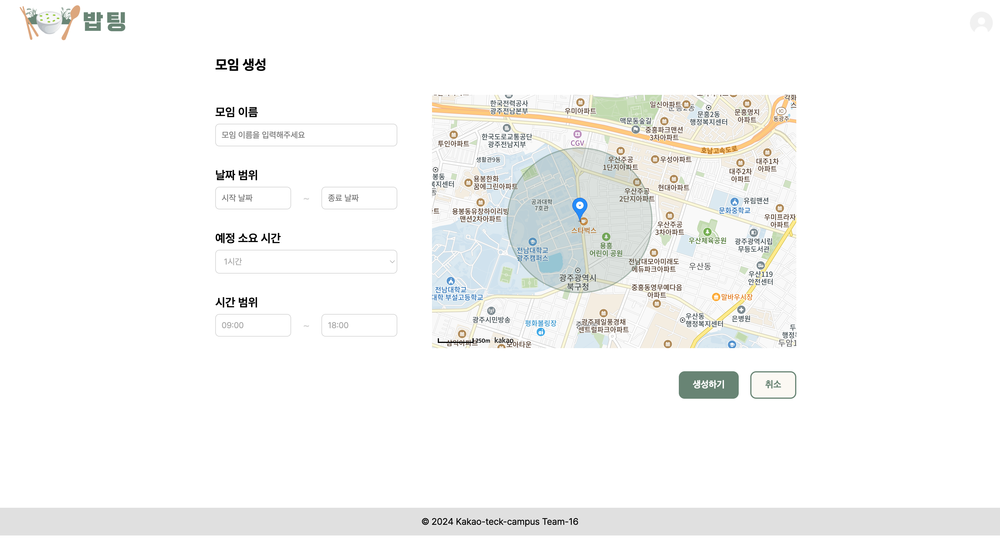
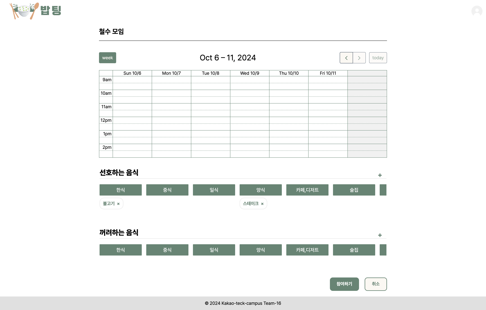
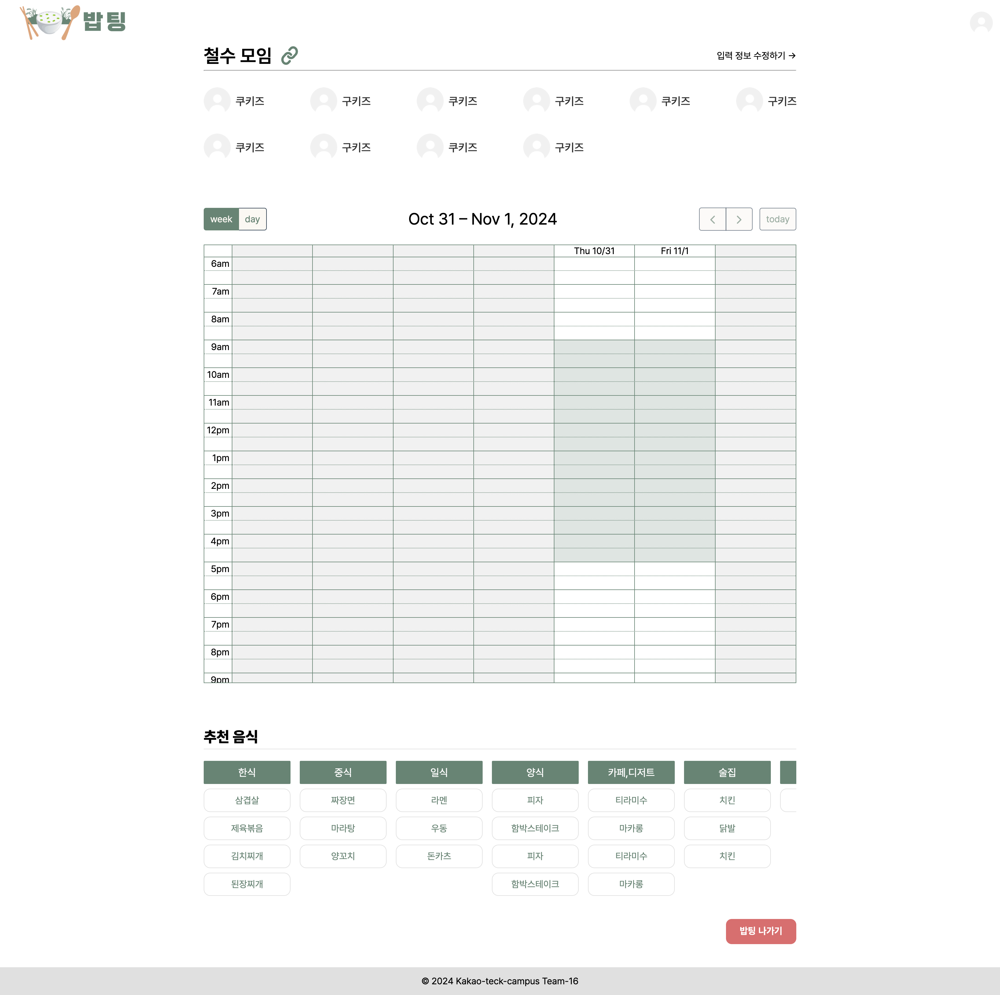
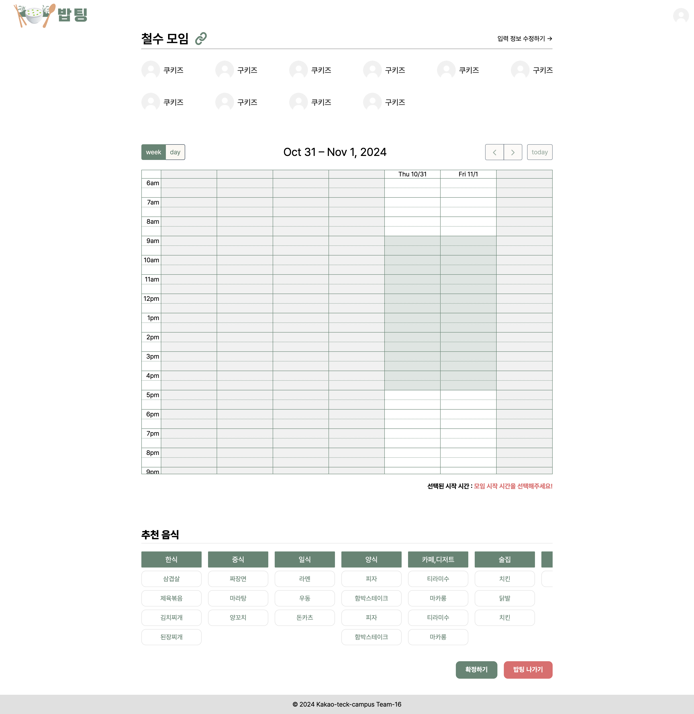
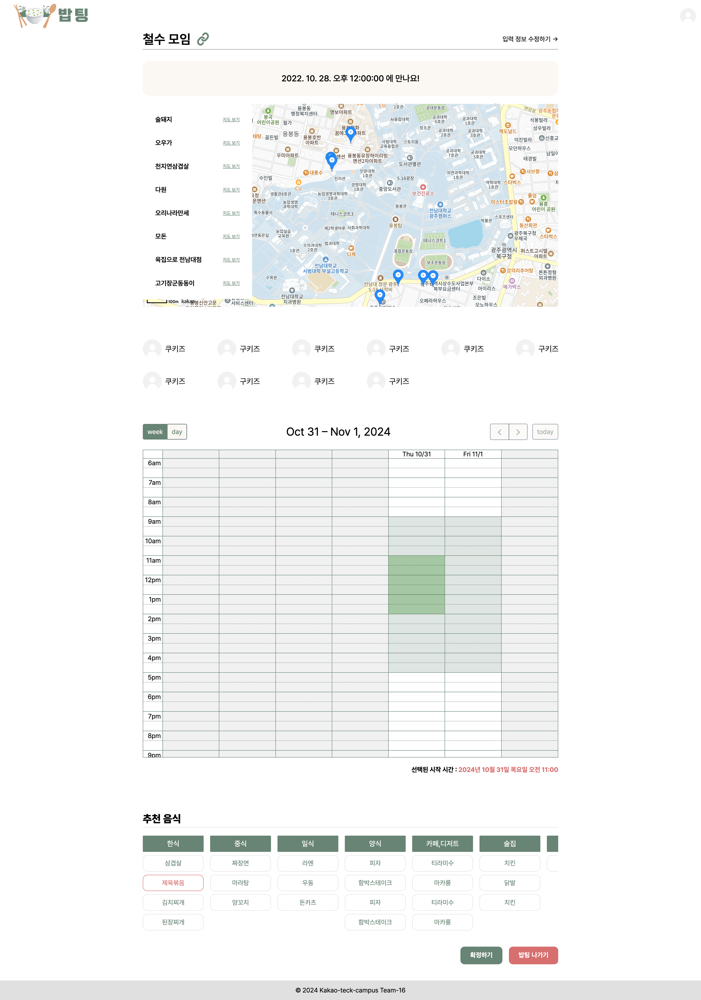

| 기능             | 이미지                         | 설명                                                                                                                                                      |
|----------------|-----------------------------|---------------------------------------------------------------------------------------------------------------------------------------------------------|
| **카카오 로그인**    |       | 카카오 로그인으로 간편하게 서비스를 사용할 수 있습니다.                                                                                                                         |
| **메인페이지**      |          | 톡캘린더로 연동된 개인의 일정, 확정된 모임과 확정 대기 중인 모임을 확인할 수 있습니다. 최종 확정된 모임은 모임 목록에서 쉽게 확인할 수 있으며, 확정되지 않은 모임은 '확정 대기중인 모임'으로 표시되어 관리가 용이합니다.                      |
| **모임 생성**      |           | 모임 주최자는 모임 이름, 날짜 범위, 예상 소요 시간, 시간 범위, 원하는 위치 등을 설정하여 모임을 생성할 수 있습니다.  설정된 내용은 링크를 통해 모임에 초대된 사람들에게 자동으로 공유됩니다.                                     |
| **모임 참여**      |           | 초대받은 사용자는 가능한 시간과 선호/비선호 음식을 추가하여 모임에 참여할 수 있습니다.  개별 일정과 음식 취향을 반영하여 더 만족스러운 모임을 준비할 수 있도록 돕습니다.                                                   |
| **모임 관리(참여자)** |  | 모임 참여자들은 가능한 시간과 참여자들의 데이터를 기반으로 추천된 음식을 한눈에 확인할 수 있습니다.                                                                                                |
| **모임 관리(주최자)** |  | 모임 주최자는 다른 사용자들이 공통적으로 가능한 시간과 모임의 추천된 음식을 한눈에 확인할 수 있습니다.  이 추천음식들 중 메뉴를 확정하고, 공통 가능한 시간 중 약속 시작 시간을 결정할 수 있습니다. 주최자가 '밥팅 나가기'를 누르면 모임이 사라집니다. |
| **모임 확정**      |           | 모임의 모든 사용자들은 지정한 위치와 확정된 시간 그리고 추천 음식들을 한눈에 확인할 수 있습니다.                                                                                                 |

## 기획 의도

---
식사 약속을 계획할 때 **여러 사람의 일정과 음식 취향을 맞추는 것**은 생각보다 많은 시간과 노력을 필요로 합니다.
특히 가족, 친구, 직장 동료 등 다양한 사람들과 모임을 계획할 때 참여자들 간의 스케줄을 조율하고 모두가 만족할 메뉴를 고르는 과정에서 불편함이 발생할 수 있습니다.

현재 약속 조율 서비스는 많지만, 약속 위치와 일정 그리고 음식 취향을 종합적으로 고려하여 모임을 준비하는 데 필요한 서비스는 존재하지 않습니다.

🍚**Babting**🍚은 이러한 불편함을 해결하기 위해 **모임 참여자들의 일정과 음식 선호도를 반영하여 최적의 약속 시간과 메뉴를 추천하는 서비스**를 기획하게 되었습니다.

## 서비스 소개

---
### ✨최적의 식사 약속 시간, 메뉴, 장소를 정할 수 있는 서비스  "Babting" ✨

##### 🔑 간편한 소셜 로그인
◦ 카카오 소셜 로그인을 통해 빠르고 쉽게 서비스에 접근할 수 있으며, 간단한 회원가입으로 바로 이용할 수 있습니다.
  

##### ✏️ 톡캘린더 연동을 통한 일정 확인
◦ 톡캘린더 연동을 통해 사용자는 자신의 기존 일정을 손쉽게 확인할 수 있습니다. 
◦ 사용자들은 자신의 일정과 겹치지 않는 시간을 선택하여 모임에 참여할 수 있습니다.
  

##### 🗨️ 참여자 간의 선호/비선호 음식 취향 반영
◦ 모임에 참여한 사용자는 자신이 선호하는 음식과 비선호 음식을 등록할 수 있습니다. 
◦ Babting은 이 데이터를 바탕으로 모든 참여자가 만족할 수 있는 추천 메뉴를 제안해드립니다.
  

##### 📜 모임 진행 상황 공유 및 시간,메뉴 확정
◦ 모임 주최자는 참여자들의 가능한 시간과 음식 취향을 실시간으로 확인할 수 있습니다. 
◦ 모임 주최자는 공통 가능한 시간을 기반으로 최적의 약속 시간을 정하고, 추천 메뉴를 선택하여 최종 확정할 수 있습니다.

